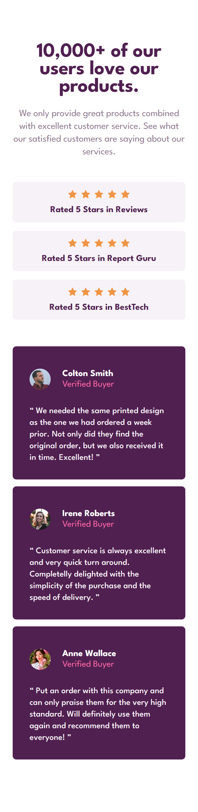

# Frontend Mentor - Social proof section solution

This is a solution to the [Social proof section challenge on Frontend Mentor](https://www.frontendmentor.io/challenges/social-proof-section-6e0qTv_bA). Frontend Mentor challenges help you improve your coding skills by building realistic projects. 

## Table of contents

- [Overview](#overview)
  - [The challenge](#the-challenge)
  - [Screenshot](#screenshot)
  - [Links](#links)
- [My process](#my-process)
  - [Built with](#built-with)
  - [What I learned](#what-i-learned)
  - [Continued development](#continued-development)
  - [Useful resources](#useful-resources)
- [Useful commands](#useful-commands)
- [Author](#author)

## Overview

### The challenge
- Responsive layout section in a form of testimonials & rating.
- Users should be able to:
    - View the optimal layout for the section depending on their device's screen size

### Screenshot
<div>
  
  
</div>

### Links

- Solution URL: [My solution URL](https://github.com/MiloosN5/FrontendMentor_SocialProofSectionMaster_Challenge)
- Live Site URL: [My live site URL](https://miloosn5.github.io/FrontendMentor_SocialProofSectionMaster_Challenge/)


## My process

### Built with

- Semantic HTML5 markup
- Tailwindcss
- BEM
- Flexbox
- Mobile-first workflow
- REM (Root EM) & EM (for Responsive)
- Responsive layout
- React

### What I learned

* React
    Learn to split the code into the reusable components. This example is made of the three main parts - header, rating & testimonials. Given that, we can make three different components that later will be joined in the 'App.jsx'. Within the rating & testimonials sections, we have templates that repeat. This leads us to dissect our 'rating' & 'testimonials' components into two components - main one (wrapper) & box template. Nonetheless, in 'rating' section we have multiple 'svg' stars. In order to not repeat them, the star can be also separate component that then will be added multiple times to the parent component using array loop.
    
    * App.jsx
        ```jsx
            function App() {
                return (
                    <main>
                        <section className="flex flex-row justify-between flex-wrap wrapper d:w-wrapper d:mx-auto">
                            <Header />
                            <Rating />
                            <Testimonials />
                        </section>
                    </main>
                )
            }                
      ```   

    * Rating.jsx
        In the 'Rating' component, we call 'Rating_box' component three times
        ```jsx
            const Rating = () => {
                return (
                    <section className=" flex flex-col gap-rating d:gap-rating--d ...">
                        {[...Array(3)].map((x, index) =>
                            <Rating_box key={index} id={index}/>
                        )}
                    </section>
                )
            }              
      ``` 

    * Rating_box.jsx
      In the 'Rating_box' component, we call 'Star' component five times
      ```jsx
        const Rating_box = ({title, id}) => {
            ...
            return (
                <article id={id} className=...>
                    <div className="flex flex-row gap-rating__star d:gap-rating__star--d">
                        {[...Array(5)].map((x, index) =>
                            <Star key={index} />
                        )}
                    </div>
                    <h2 className="...">{title}</h2>
                </article>
            )
        }            
      ```

* Tailwindcss
    This is a utility-first CSS framework with pre-defined classes. Along with big assortment of different classes, we can also make our own custom classes. These custom classes are added as a theme.extend in the 'tailwind.config.js' file. In the extend object, we can set our version (value) of the certain property. It is useful due its reusability. If we want custom property to only appears one, we don't need to added it in this file, we can use something called 'arbitrary values'. These values can be added directly in the HTML/JSX as a extend of the certain property.
    * **Differ between instances of the same component**
        As we can see in this challenge, despite having some common templates (for rating & testimonials), there are also differ between them. This differ is express through different info (e.g. text & image). In that case, we can use 'props' to send values from parent (e.g. rating) to the child (rating_box). Then, in the child component, we need to distinguish instances (cases). It can be done using e.g. "id" prop.<br>
        **Note** Be careful here, because we need 'id' not 'key' prop to send to the child, because 'key' is one of the props that can't be forwarded to the child component. Still, we need 'key' as React require that each element of the collection needs to have unique key. Using a ternary operator, we can determine which values will be assign to which instance. Eventually, this value can be added to the element using javascript expression "{}".

        * Rating_box.jsx
            ```jsx
                const Rating_box = ({title, id}) => {
                    var title = (id==0) ? 'Rated 5 Stars in Reviews' : (id==1) ? 'Rated 5 Stars in Report Guru' : 'Rated 5 Stars in BestTech';
                    var place_self = (id==0) ? 'd:place-self-start' : (id==1) ? 'd:place-self-center' : 'd:place-self-end';
                    
                    return (
                        <article id={id} className={`flex flex-col ... ${place_self}`}>
                            <div className="...">
                                {[...Array(5)].map((x, index) =>
                                    <Star key={index} />
                                )}
                            </div>
                            <h2 className="...">{title}</h2>
                        </article>
                    )
                }
            ```      
        
* place-self
    In both 'rating' & 'testimonials' sections, there are layout which items are not aligned. Each item is aligned differently - one at the start, the following one is in the center and the final one is at the end. In CSS, there is property called 'place-self'. It is shorthand for 'justify-self' & 'align-self'. That means that it aligns the item in the both block and inline directions.

### Continued development

* In-depth explorating of React.
* Aspiration to make better responsive layout.
* Aspiration to make better structure of React components.
* Tending to improve BEM naming convention.
* Understand more complex grid & flex layouts.

### Useful resources

- [React - Components & Props](https://legacy.reactjs.org/docs/components-and-props.html) - Components are independent and reusable bits of code. They serve the same purpose as JavaScript functions, but work in isolation and return HTML.
- [BEM](https://en.bem.info/) - BEM naming convention is also really important for any projects, expecially the bigger ones.
- [Typographic Hierarchy](https://www.toptal.com/designers/typography/typographic-hierarchy) - Understanding your website structure/hierarchy sometimes can be difficult. Determing accurately typography can be half job done. 
- [An Introduction to Block Element Modifiers (BEM)](https://opensenselabs.com/blog/articles/introduction-block-element-modifiers) - Difference between Block, Modifier and Element.
- [Understanding CSS BEM](https://codeburst.io/understanding-css-bem-naming-convention-a8cca116d252) - Examples of how BEM class namings can be done.
- [BEM Grandchildren](https://scalablecss.com/bem-nesting-grandchild-elements/) - Handling naming of the nesting elements.
- [BEM 101](https://css-tricks.com/bem-101/) - Another source about BEM.
- [Tailwindcss](https://tailwindcss.com/) - Official website of the Tailwindcss. Really useful source, since it's docs is very easy to handle, readable & cover different cases - which predefinex class to use, examples, customizing your theme and so on.
- [key prop - Special props warning](https://legacy.reactjs.org/warnings/special-props.html) - Pay attention that 'key' & 'ref' can't be forwarded.
- [place-self](https://www.geeksforgeeks.org/css-place-self-property/) - There is a lot of resources that talk about this topic. 'Geeksforgeeks' helped me solve a lot of my doubts/mistakes and it covers a lot of topics, including this one.
- [Tailwindcss - Dynamic Class Name](https://stackoverflow.com/questions/69687530/dynamically-build-classnames-in-tailwindcss) - If you came across an any obstacle, there is a big change that you will find your answer at the 'Stackoverflow'. Also, you can post a question.

## Useful commands

React
- create new vite application (with React)
    * npm create vite@latest 
- install needed packages
    * npm install
- serve app on the localhost (see package.json)
    * npm run dev
- build (predeploy) app for the production - create dist folder (see package.json)
    * npm run build
- deploy app to the GitHub Pages (see package.json)
    * gh-pages -d dist

## Author

- GitHub - [MiloosN5](https://github.com/MiloosN5)
- Frontend Mentor - [@MiloosN5](https://www.frontendmentor.io/profile/MiloosN5)


